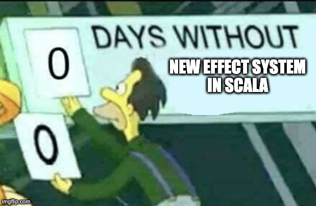
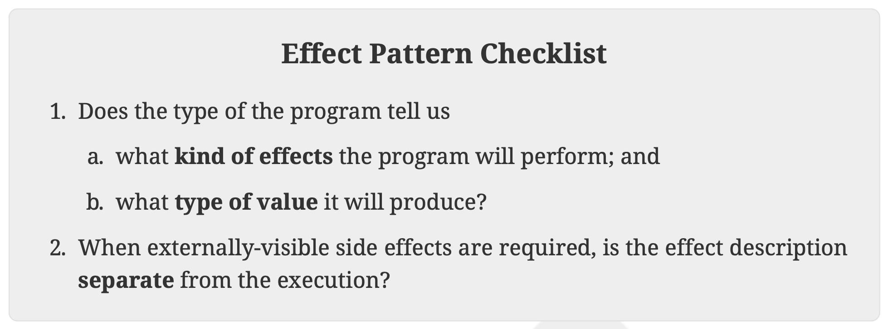

<style>
  header,footer {
    color:rgb(34, 34, 35);
    background-color: #ffffff00;
  }
  h1, h3, h4 {
    color:rgb(47, 95, 4);
  }
  section > *  {
    background-color: #ffffff77;
  }
</style>


<!-- _paginate: false -->
<!-- _footer: "" -->

# Do You Even Handle Effects?
### Direct-Style Effect System in Scala

---

<!-- _class: lead -->



---

# Agenda

* 👋 Who Am I?
* ❤️ Effects and 💔 Side Effects
* 🍱 Scala Monadic Effect Systems
* 🛠️ Build Your Own Effects System in Direct-Style
* ➕ Adding Monadic Operations
* 🏁 Conclusions and References

___

# Who Am I?

- Hello there 👋, I'm **Riccardo Cardin**, 
    * An Enthusiastic Scala Lover since 2011 💯

&nbsp;&nbsp;&nbsp;&nbsp;&nbsp;&nbsp;&nbsp;&nbsp;&nbsp;&nbsp;&nbsp;&nbsp;&nbsp;&nbsp;&nbsp;&nbsp;&nbsp;&nbsp; 

---

<!-- _class: lead -->
# Effects and Side Effects

---

# Why We ❤️ Functional Programming

* We have the **substitution model** for reasoning about programs
```scala 3
def plusOne(i: Int): Int = i + 1
def timesTwo(i: Int): Int = plusOne(plusOne(i))
```
* The substitution model enables **local reasoning** and **referential transparency**
  * Original program and the substituted program are *equivalent*
* We call these functions *pure* functions

---

# We Live in an Imperfect World 💔

> Model a coin toss, but with a twist: the gambler might be too drunk and lose the coin

```scala 3
import scala.util.Random

def drunkFlip(): String = {
  val caught = Random.nextBoolean()
  val heads =
    if (caught) Random.nextBoolean()
    else throw new Exception("We dropped the coin")
  if (heads) "Heads" else "Tails"
}
```

---

# We Live in an Imperfect World 💔

* We can't use the substitution model for all programs
  * If the `drunkFlip` function throws an _exception_, the substitution model breaks

* Programs that interact with a context outside the function
  * The result of the `drunkFlip` function depends on the state of the world

* Multiple calls to `drunkFlip` can return different results

---

# Side Effects

* **Side Effect**: An _unpredictable change_ in the state of the world
  * *Unmanaged*, they just happen

```scala 3
// What happens if b is equal to zero?
def divide(a: Int, b: Int): Int = a / b
```

* We call `divide` an *impure* function
* The best we can do is to **track** and push them to the _boundaries_ of our system

---

# The Effect Pattern

When a side effect is _tracked_ and _controlled_ we call it an **effect**
  1. The _type_ of the function should tell us what effects it can perform and what's the type of the result
    - The `drunkFlip` deals with _non-determinism_ and _errors_
  2. We must separate the _description_ from making it happen
    - We want a _recipe_ of the program.
    - **Deferred execution**

The pattern lets us use the **substitution model** again 🚀 🎉

---

<style scoped>
    p {
      font-size: 20pt;
    }
</style>

# The Effect Pattern


© Adam Rosien, Essential Effects

---
<style scoped>
section h3 {
  text-align: center;
}
</style>

# Fun Fact 🤡

Which is the first try of an effect system on the JVM? 🤔

### 🤪 Java Checked Exceptions 🤪

```java
String readFile(String path) throws IOException { /*... */ } 
```

❤️‍🔥 They _tracks_ the side effects with the _exception type_
❤️‍🔥 We must provide a _handler_ for the effect (exception)
🤷‍♂️ They _don't defer_ the execution and are _hard to compose_

---

# An Effect Example

We can use **Monads**, `F[A]`, (which fits well for the task)

* Composing function returning effects is not trivial
  * `F[_]`: We can use `flatMap` and `map`
  * Different monads are _hard to compose_ (Monad Transformers)

* The `Option[A]` type models the conditional lack of a value 

```scala 3
val maybeInt: Option[Int] = Some(42)
val maybeString: Option[String] = maybeInt.map(_.toString)
```

---

# Gently Reminder

Calling `map` and `flatMap` is cumbersome and boring  😴

```scala 3
val maybeString: Option[String] = Some(42).flatMap { maybeInt =>
  maybeInt.map(i => i.toString)
}
```
We can use a _for-comprehension_ to make it more readable 🥹

```scala 3
val maybeString: Option[String] = for {
  maybeInt <- Some(42)
  i <- maybeInt
} yield i.toString
```

---

# Effect Systems

An **Effect System** is the implementation of the _Effect Pattern_

* It expresses side effects with **dedicated types**
* It replaces side-effecting operations in standard libraries
* It provides structures to manage effects

In an effect system, a side effect 👎 becomes a **tracked** effect 👍

---

<!-- _class: lead -->
# Scala Monadic Effect Systems

---

# Cats Effect

* Cats Effect uses the `IO[A]` data type to model effects
  * `IO[A]` is an _über effect_ that models any effectful computation that returns a value of type `A` and can fail with a `Throwable`
  * It's a _monad_ so we must use `flatMap` and `map` to compose effectful functions
  * `IO[A]` is **referentially transparent** and **lazy** 
  * Redefines the effectful part of the Standard Library
  * Implements _structured concurrency_

---

# Cats Effect

Let's rewrite the `drunkFlip` function using the `IO` effect

```scala 3
def drunkFlip: IO[String] =
  for {
    random <- Random.scalaUtilRandom[IO]
    caught <- random.nextBoolean
    heads <-
      if (caught) random.nextBoolean
      else IO.raiseError(RuntimeException("We dropped the coin"))
  } yield if (heads) "Heads" else "Tails"
```
The `drunkFlip` function returns a _recipe_ of the program

---

# Cats Effect

The library provides many ways to _run_ the effect

```scala 3
object Main extends IOApp.Simple {
  def run: IO[Unit] = drunkFlip.flatMap(result => IO.println(result))
}
```
There are also some _unsafe_ methods to run the effect

```scala 3
val result: String = drunkFlip.unsafeRunSync()
val resultF: Future[String] = drunkFlip.unsafeToFuture()
```
---

# Cats Effect

The `IO[A]` hides the exact side effects that were performed. We can make them explicit using _Tagless Final_ syntax and an MTL library

```scala 3
def drunkFlipF[F[_]: Monad](using R: Raise[F, String], A: Random[F]): F[String] =
  for {
    caught <- A.nextBoolean
    heads <-
      if (caught) A.nextBoolean
      else R.raise("We dropped the coin")
  } yield if (heads) "Heads" else "Tails"
```
The cognitive load is higher here 😱

___

# ZIO

* `ZIO[R, E, A]` introduces the error type `E` and dependencies `R` in the effect definition
  * It's still a monad on the `A` type (`map` and `flatMap`)
  * It provides a _rich algebra_ on the `ZIO` type to avoid monad transformers
  * It's a _referentially transparent_ and _lazy_ effect
  * It provides _structured concurrency_ primitives
  * ...still a über effect

---

# ZIO

The `drunkFlip` function using `ZIO` effect is the following:

```scala 3
def drunkFlip: ZIO[Random, String, String] =
  for {
    caught <- Random.nextBoolean
    heads <-
      if (caught) Random.nextBoolean
      else ZIO.fail("We dropped the coin")
  } yield if (heads) "Heads" else "Tails"
```

**Effects are _explicit_** in the `R` type, and we can fail with _custom errors_

---

# ZIO

Running the effect means providing needed dependencies or _layers_ 

```scala 3
object Main extends ZIOAppDefault {
  override def run =
    drunkFlip.flatMap { result =>
      Console.printLine(result)
    }.provideLayer(ZLayer.succeed(RandomLive))
}
```

* We can use intersection type: `Random & Console`
* We must fulfill _all the dependencies_ at once to run the effect

---

# Kyo: Meet Algebraic Effects

What if we can have types _listing Effect separately_ and _handling_ them virtually _once at a time_?

**Algebraic Effects and Effect Handlers** do exactly that 🎉
 * The type of the function tells us exactly what effects it uses
 * **Kyo** is a novel library implementing Algebraic Effects

```scala 3
def drunkFlip: String < (IO & Abort[String]) = ???
```

---

# Kyo: Meet Algebraic Effects

* Each effect has its own _rich algebra_ to describe the operations

```scala 3
def drunkFlip: String < (IO & Abort[String]) = for {
  caught <- Random.nextBoolean
  heads  <- if (caught) Random.nextBoolean else Abort.fail("We dropped the coin")
} yield if (heads) "Heads" else "Tails"
```

* Kyo uses a _monad_ to represent the effectful computation
  * The `<` type is an alias for a monad indeed 😅
  * We still have to use `flatMap` and `map` 

---

# Kyo: Meet Algebraic Effects

We can decide to _handle each effect separately_ (no über effect)

```scala 3
val partialResult: Result[String, String] < IO = Abort.run { drunkFlip }
```

* `Abort.run` is called an **Effect Handler**
  * It executes the `Abort` effect. The `IO` effect is _left untouched_

* Virtually, we can define our effect handler without changing the original recipe
  * For example, for testing purposes
---

<!-- _class: lead -->
# Build Your Own Effects System
#### (with love ❤️)

---

# Build Your Own Effects System 🛠️

* All the effect systems we've seen are based on _monads_ properties to _compose effectful functions_
  * They use combinators, `flatMap` and `map`, for sequencing
  * Programs are represented by **values**
  * They are _referentially transparent_ and _lazy_

However, their step curve is _steep_ and _hard to learn_ for newbies 😱 

Can we do better (or at least different)? 🤔

---

# What's the Direct-Style? 🛝

```scala 3
val caught = scala.util.Random.nextBoolean() // <- No monads here
```
However, we need **deferred execution** and to track the effects

```scala 3
val caught: Random => Boolean = r => r.nextBoolean 
```

* Working with _functions_ instead of _values_ could be cumbersome 🙄
  * ...or maybe not? 🤔

Let's try to build an effect system using _functions_ instead of _values_ 🛠️
  
---

# Model the Effects' Algebra 🛠️

We'll focus on the `drunkFlip` example. We need effects that model 
✔️ non-determinism (`Random`), 
✔️ errors (`Raise`)

```scala 3
trait Random {
  def nextBoolean: Boolean // <- Algebra of the effect
}
trait Raise[-E] { // <- `E` represents the error type
  def raise(error: => E): Nothing
}
```

---

# Access Std Library as an Effect

We need now to wrap the standard library with the effects

```scala 3
object Random {
  private val unsafe = new Random {
    override def nextBoolean: Boolean = 
      scala.util.Random.nextBoolean()
  }
}
```
We call the variable `unsafe` ☣️ because it gives _direct_, _uncontrolled_ access to the side effect 

___

# Access Std Library as an Effect

We want to give tracked access to the side effects. Let's add some functions (a DSL) to our `object Random`

```scala 3
object Random {
  def nextBoolean(using r: Random): Boolean = r.nextBoolean
}
```

To generate a random `Boolean`, we need to _provide_ an instance of the `Random` effect
* Calling `Random.nextBoolean` produces a _recipe_ for the program

---

# Wrap It All Together

We have now all the bricks to build the `drunkFlip` function again 🙌

```scala 3
def drunkFlip(using Random, Raise[String]): String = {
    val caught = Random.nextBoolean
    val heads  = 
      if (caught) Random.nextBoolean 
      else Raise.raise("We dropped the coin")
    if (heads) "Heads" else "Tails"
  }
```

Is it magic 🪄? Variables `caught` and `heads` are treated as `Boolean`?! 🤯

---

# Welcome Context Functions 👋

* Scala 3 introduces **Context Functions**, fancy anonymous functions with only _implicit context parameters_

```scala 3
val program: (Raise[String], Random) ?=> String = drunkFlip
```

* Treated as **values** in contexts with the same implicit parameters
  * However, they are _recipes_ to obtain the result

```scala 3
def drunkFlip(using Random, Raise[String]): String = {
  val caught: Boolean = Random.nextBoolean // 🤯
```

---

# Welcome Context Functions 👋

Behind the scenes, the Scala compiler rewrites the context function using a _surrogate type, not visible to the user_

```scala 3
trait ContextFunctionN[-T1, ..., -TN, +R]:
  def apply(using x1: T1, ..., xN: TN): R
```

Our `program` is rewritten as:

```scala 3
val program: new ContextFunction2[Raise[String], Random, String] {
  def apply(using Raise[String], Random): String = drunkFlip
}
```

---

# Handle the Effects

* Handlers are the structures that effectively _run_ effectful functions

```scala 3
object Raise {
  def raise[E](error: => E)(using r: Raise[E]): Nothing = r.raise(error)
  def run[E, A](program: Raise[E] ?=> A): E | A =
    boundary {
      given unsafe: Raise[E] = new Raise[E] {
        override def raise(error: => E): Nothing = break(error)
      }
      program
    }
}
```

---

# Handle the Effects

* The Handler for the `Raise[E]` effect provides the `given` instance of the context parameter
  * We used the `boundary` and `break` functions to _control_ the effect

```scala 3
val program: Random ?=> String | String = Raise.run { drunkFlip }
```

* The `Raise.run` handler _runs_ the `Raise` effect, leaving the `Random` effect _untouched_ 🥷
  * It's _curryfication_, but on a context parameters level
---

# Handle the Effects

* Changing the handler changes the _behavior_ of the program
  * We can handle a `Raise[E] ?=> A` as an `Either[E, A]`

```scala 3
object Raise {
  def either[E, A](program: Raise[E] ?=> A): Either[E, A] =
    boundary {
      given r: Raise[E] = new Raise[E] {
        override def raise(error: => E): Nothing = break(Left(error))
      }
      Right(program)
    }
}
```

---

# Handle the Effects

Implementing the `Random` handler is relatively easy 👍

```scala 3
def run[A](program: Random ?=> A): A = program(using Random.unsafe)
```

We can even provide a test version of the `Random` effect

```scala 3
def test(fixed: Boolean)(program: Random ?=> Boolean) = {
  program(using new Random() {
    override def nextBoolean: Boolean = fixed
  })
}
```

---

# Handle the Effects

* We can run all the effects of the `drunkFlip` function _stacking_ the handlers
  * We should do it at the _boundaries_ of the system

```scala 3
val result: Either[String, String] = Random.run { 
  Raise.either { 
    drunkFlip 
  } 
}
```
...and we're done 🎉

---

# Properties of the Effect System

* We can say this Effect System uses **Direct-Style Effect Handlers**
* It implements the _Effect Pattern_
  * The type tells us the used _effects_ and the type of the _result_
  * The execution is _deferred_

```scala 3
type Effect[E, A] = E ?=> A
```

* We have lost _referential transparency_ 😰

---

# Goodbye Referential Transparency 👋

```scala 3
def drunkFlip(using Random, Raise[String]): String = {
    val genRand = Random.nextBoolean
    val caught = genRand
    val heads  = 
      if (caught) genRand 
      else Raise.raise("We dropped the coin")
    if (heads) "Heads" else "Tails"
  }
```

* `genRand` is eagerly evaluated: 
    * Is all hope lost? 😱

___

# The `def` Trick 🪄

```scala 3
def drunkFlip(using Random, Raise[String]): String = {
    def genRand = Random.nextBoolean
    val caught = genRand
    val heads  = 
      if (caught) genRand 
      else Raise.raise("We dropped the coin")
    if (heads) "Heads" else "Tails"
  }
```

* Using the `def` keyword, we can _defer_ the evaluation of `genRand`
  * But do we need referential transparency? 🤔

___

# Where's My `IO` Effect?

* Sometimes bad things happen. _Unpredictable_ errors are thrown
* We want to execute an effectful function in a _dedicated process_

```scala 3
trait IO {}// Maybe Deferred would be a better name

object IO {
  def apply[A](program: => A): IO ?=> A = program
  def runBlocking[A](program: IO ?=> A): Try[A] = {
    val es: ExecutorService = Executors.newVirtualThreadPerTaskExecutor()
    Try { es.submit(() => program(using new IO {})).get() }
  }
}
```

---

# Do We Like Direct-Style?

💔 We lost referential transparency, but...

👍 We still have **deferred execution**
👍 We can still **track effects**
👍 We have a syntax that is **easy to read and write**

👎 A novel approach with many unknowns

Probably, it is not the best solution for every problem, but it is a **valid alternative** in 80% of the cases  🤓


___

# Where's My `IO` Effect?

* We can use Java Virtual Threads
  * Virtual Threads are implemented using _continuations_
  * They represent _fibers_ 🧶, or _green threads_ on the JVM
  * From Java 24, they are also safe for `synchronized` blocks 🎉
  * They support _structured concurrency_ 🤝

```scala 3
val program: IO ?=> Int = IO {
  42  / 0
}
val result: Try[Int] = IO.runBlocking { program }
```

---

<!-- _class: lead -->
# Adding Monadic Operations

---

# Bonus Track

What if we can define `flatMap` and `map` in our Effect System 🤓?

We need to play some tricks. Let's define a class surrounding an effect and implement the `flatMap` and `map` functions on it

```scala 3
final class Effect[F](val unsafe: F)
object Effect {
  extension [F, A](eff: Effect[F] ?=> A) {
    inline def flatMap[B](inline f: A => Effect[F] ?=> B): Effect[F] ?=> B = f(eff)
    inline def map[B](inline f: A => B): Effect[F] ?=> B = eff.flatMap(a => f(a))
  }
}
```

---

# Bonus Track

We need to refactor the effects and the handlers accordingly (the refactor of the `Raise[E]` effect is omitted)

```scala 3
object Random {
  def nextBoolean(using r: Effect[Random]): Boolean = r.unsafe.nextBoolean

  def run[A](program: Effect[Random] ?=> A): A = program(using unsafe)

  val unsafe = new Effect(new Random {
    override def nextBoolean: Boolean = scala.util.Random.nextBoolean()
  })
}
```

---

# Bonus Track

We can rewrite the `drunkFlip` function using the new DSL:

```scala 3
def drunkFlip: (Effect[Random], Effect[Raise[String]]) ?=> String = for {
  caught <- Random.nextBoolean
  heads <-
    if (caught) Random.nextBoolean
    else Raise.raise("We dropped the coin")
} yield if (heads) "Heads" else "Tails"
```

If we substitute `inline` functions, we return to the version of `drunkFlip` that doesn't use the `Effect` class 🪄✨

---

<!-- _class: lead -->
# Conclusions and References

---

# Conclusions

* We defined what is a _side effect_ and why we don't like it
* We introduced the _Effect Pattern_ and the _Effect Systems_ to manage side effects in a controlled way
* We explored the _Cats Effect_ and _ZIO_ libraries as examples of _über effects_
* We introduced the _Kyo_ library as an example of _Algebraic Effects_
* We built our own _Effect System_ on top of _Context Functions_
* We saw how we can still define `flatMap` and `map` in our _Effect System_

---

<!-- _class: lead -->

# By the way...
 
**YÆS**, _Yet Another Effect System_, 
is a library implementing what we've seen today 😜


---

<!-- _class: lead -->

# So Long, and
# Thanks for All the Fish 🐠!
# 👋
 
---

<!-- _class: lead -->

## Final Thoughts?  
🙋‍♂️ Happy to take questions !  

---

# References📚

* [Essential Effects](https://essentialeffects.dev/), Adam Rosien
* [Effect Oriented Programming](https://effectorientedprogramming.com/), Bill Frasure, Bruce Eckel, James Ward
* [Zionomicon](https://www.zionomicon.com/), John A. De Goes, Adam Fraser, Milad Khajavi
* [Effekt: Capability-passing style for type- and effect-safe, extensible effect handlers in Scala](https://www.cambridge.org/core/journals/journal-of-functional-programming/article/effekt-capabilitypassing-style-for-type-and-effectsafe-extensible-effect-handlers-in-scala/A19680B18FB74AD95F8D83BC4B097D4F), Jonathan Brachthäuser , Philipp Schuster, Klaus Ostermann

---

# References 📚

* [Kyo](https://getkyo.io/), Streamlined Algebraic Effects, Simplified Functional Programming, Peak Scala Performance
* [Scala 3 Context Functions](https://docs.scala-lang.org/scala3/reference/contextual/context-functions.html)
* [Abilities for the monadically inclined](https://www.unison-lang.org/docs/fundamentals/abilities/for-monadically-inclined/)
* [The Ultimate Guide to Java Virtual Threads](https://rockthejvm.com/articles/the-ultimate-guide-to-java-virtual-threads)
* [YÆS, Yet Another Effect System](https://github.com/rcardin/yaes), An experimental effect system in Scala using Direct-Style Effect Handlers

